# 复现 TOMAS（多尺度流体拓扑优化 + VAE + super-shapes）

复现论文 *TOMAS: topology optimization of multiscale fluid flow devices using
variational auto-encoders and super-shapes*（Padhy, Suresh, Chandrasekhar，
Struct Multidiscip Optim 2024, 67:119），原始代码：https://github.com/UW-ERSL/TOMAS

**完整复现过程见 [`docs/复现文档.md`](docs/复现文档.md)。**

## 本工作做了什么
- 在 **WSL (Ubuntu-22.04)** 中端到端配置并运行了全部代码（数据生成 → VAE 训练 →
  多尺度流动拓扑优化 → 真实 FEA 验证），复现论文 §3.1–§3.7 的全部数值实验与图像。
- 把原仓库中 **MATLAB 部分（流体数值均匀化）完整改写为 Python**
  （`dataset_py/fluid_homogenization.py`），并以解析解验证其正确性。
- 用 **MKL PARDISO（单次提速约 60×）+ 32 核 joblib 样本级并行** 加速样本生成：
  7000 个微结构均匀化由论文的 164 min（串行）降到 **18.5 min**（约 9× 壁钟加速）。
- 修复了原仓库 7 处导致无法端到端运行的问题（见文档 §2）。

## 快速开始（WSL 内）
```bash
source ~/tomas-venv/bin/activate
cd /mnt/e/Working/reproduceTOMAS
python -u dataset_py/run_data_generation.py --num-samples 7000 --data-dir TOMAS/dataset
python -u scripts/run_train_vae.py
bash scripts/run_all_experiments.sh
python scripts/collect_results.py
```

## 关键结果（与论文对照，详见文档 §5）
| 指标 | 论文 | 本复现 |
|---|---|---|
| 扩散器最大速度幅值（接触面积 60） | 2.81 | **2.77**（1.4%） |
| 弯管真实-FEA 验证误差（功率 / 接触面积） | 4.0% / 3.7% | 2.5% / 5.6% |
| 数据生成 7000 样本 | 164 min | **18.5 min** |

速度场、约束满足、真实-FEA 验证误差等关键指标与论文吻合；少数定量差异
（Pareto 单调性、个别耗散功率绝对值）源自独立训练的 2 维隐空间 VAE 重构精度有限
与梯度优化局部最优，属从零复现 VAE 类方法的预期范围。

## 三种流体物理修正方法的结果对比（P8）

从流体力学角度，**星形微结构不利于流动**（多凹腔=死区回流、各向同性高阻），而
**叶/透镜/鱼/眼/圆**有良好流动特性。围绕这一原则开了三个分支，分别从「目标惩罚 /
约束度量 / 数据库」三个层面把设计推向好流动形状：

| 分支 | 方法 | 机制 |
|---|---|---|
| [`p8a-effective-area`](../../tree/p8a-effective-area) | **A 有效接触面积** | 接触面积约束里几何周长 × 凸性折扣，星形死角周长打 6 折 |
| [`p8b-fluid-library`](../../tree/p8b-fluid-library) | **B 流体原则库** | 数据库 m≤4 只保留好流动形状（叶/透镜/鱼/圆）+ 各向异性分层 |
| [`p8c-flowquality-penalty`](../../tree/p8c-flowquality-penalty) | **C 流动品质惩罚** | 目标函数惩罚高 m（多瓣）+ 低 n（凹边），不伤拉长透镜 |

### 设计图横向对比（真实-FEA）

| 方法 | 弯管 Fig 11 | 分叉管 Fig 16 | 扩散器 Fig 13 |
|---|:---:|:---:|:---:|
| **基线 P6b**<br>(各向异性分层, 全 m) |  | 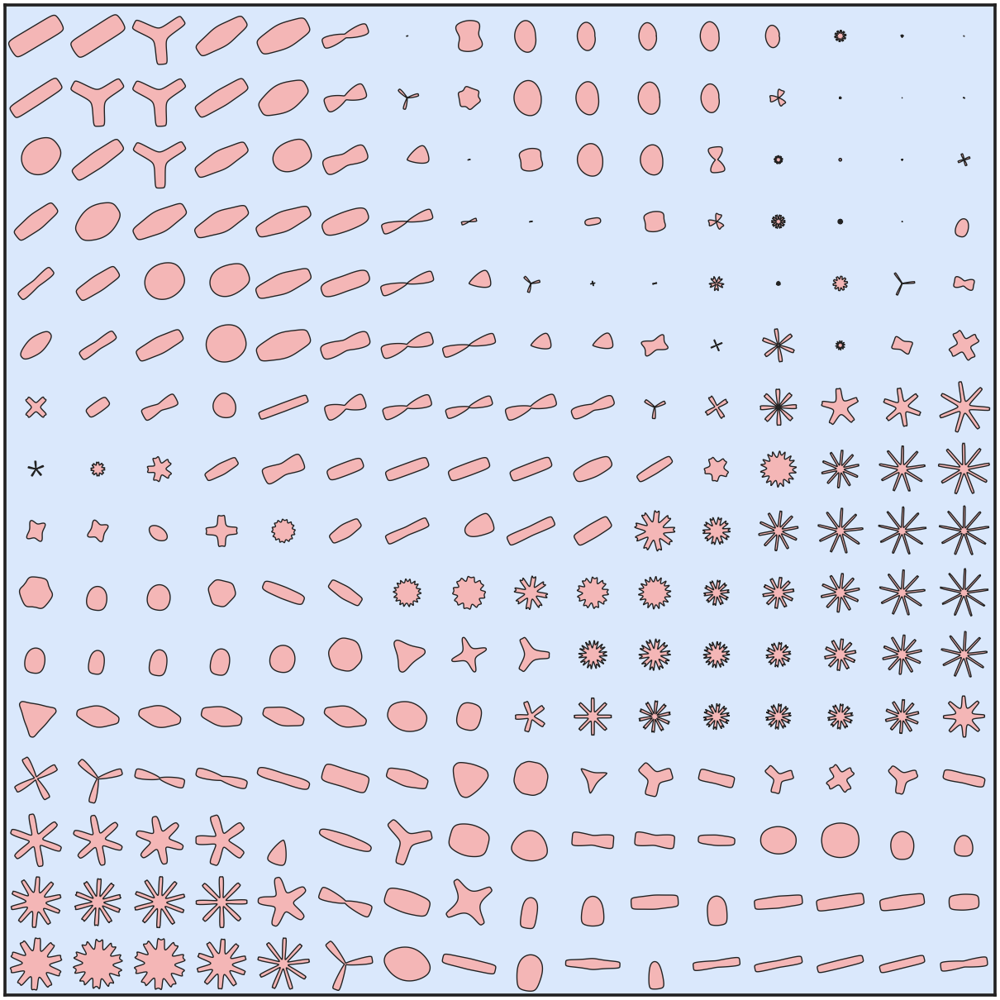 | 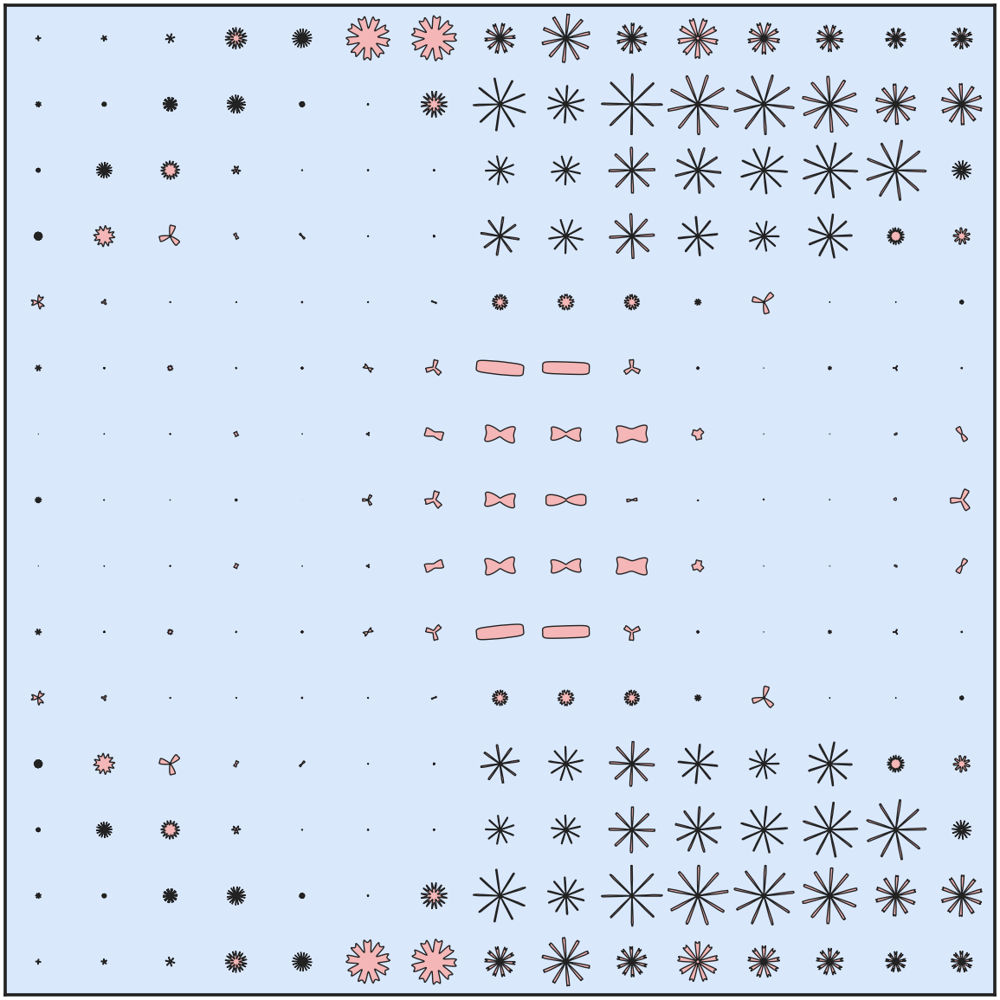 |
| **A 有效面积** |  | 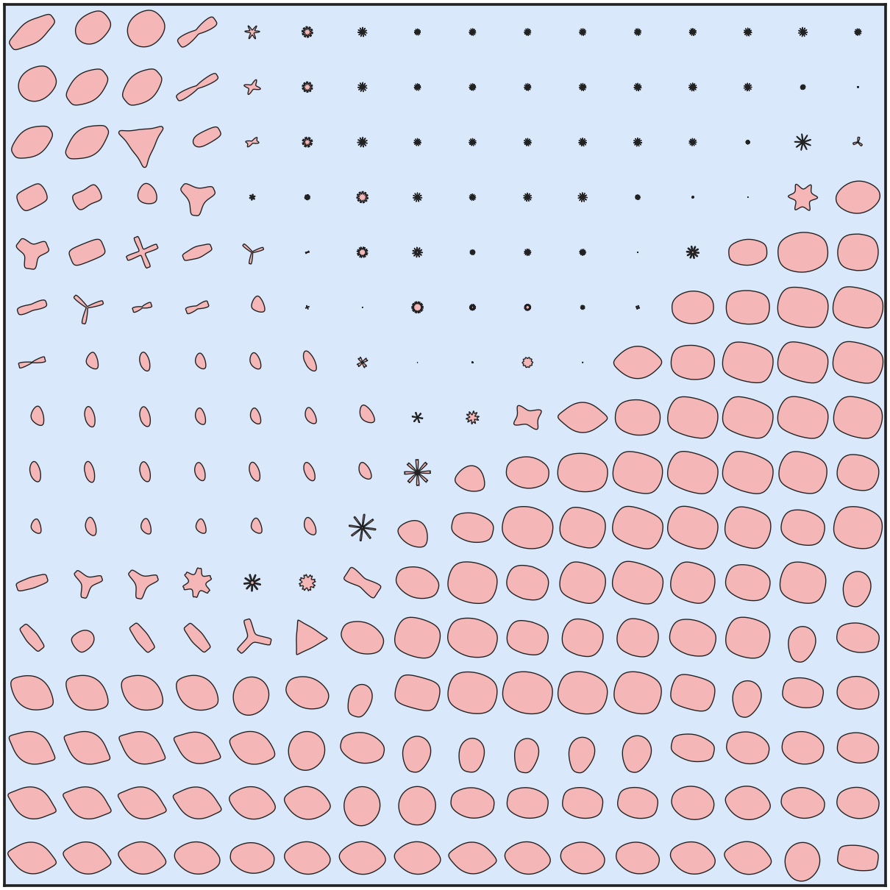 | 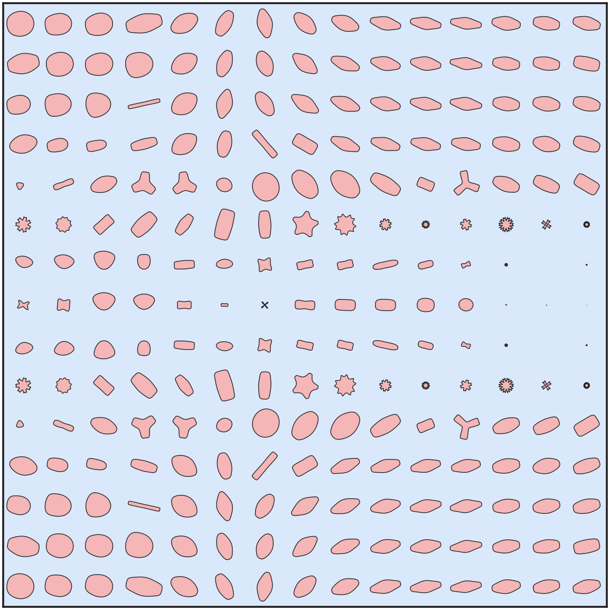 |
| **B 流体库** |  | 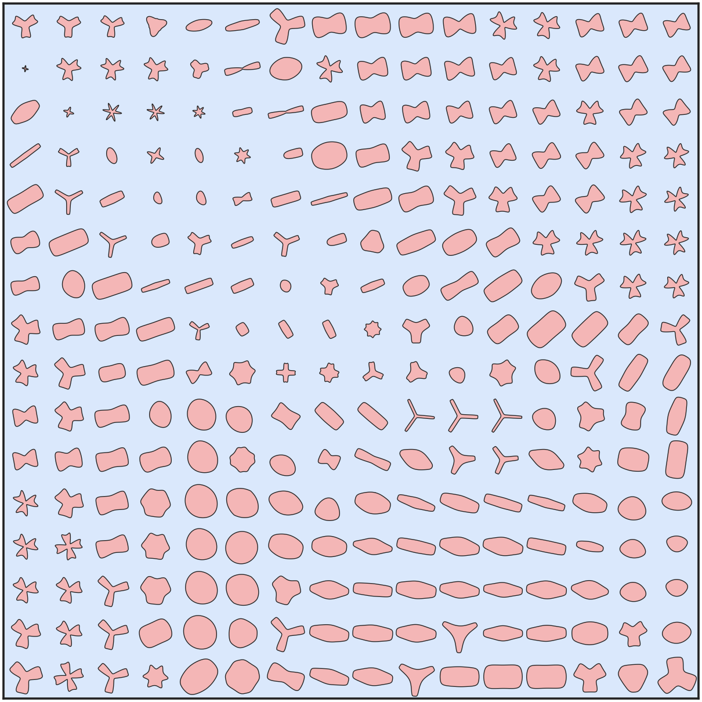 | 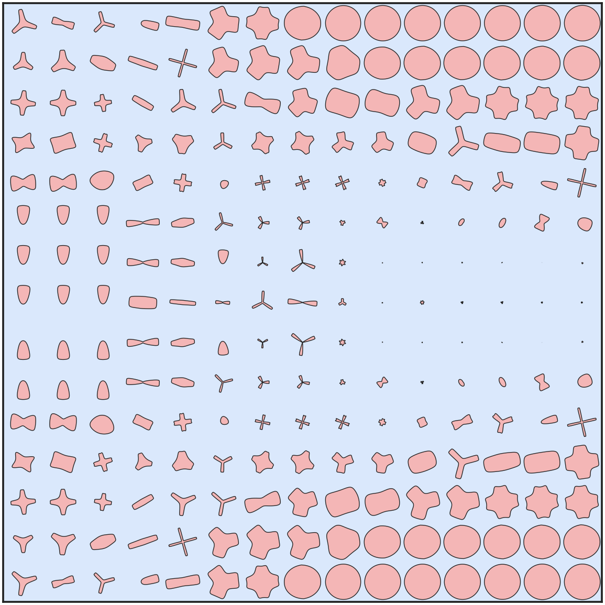 |
| **C 惩罚** | 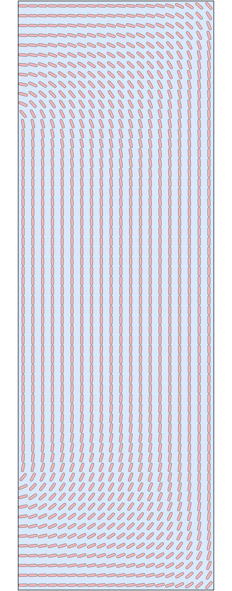 | 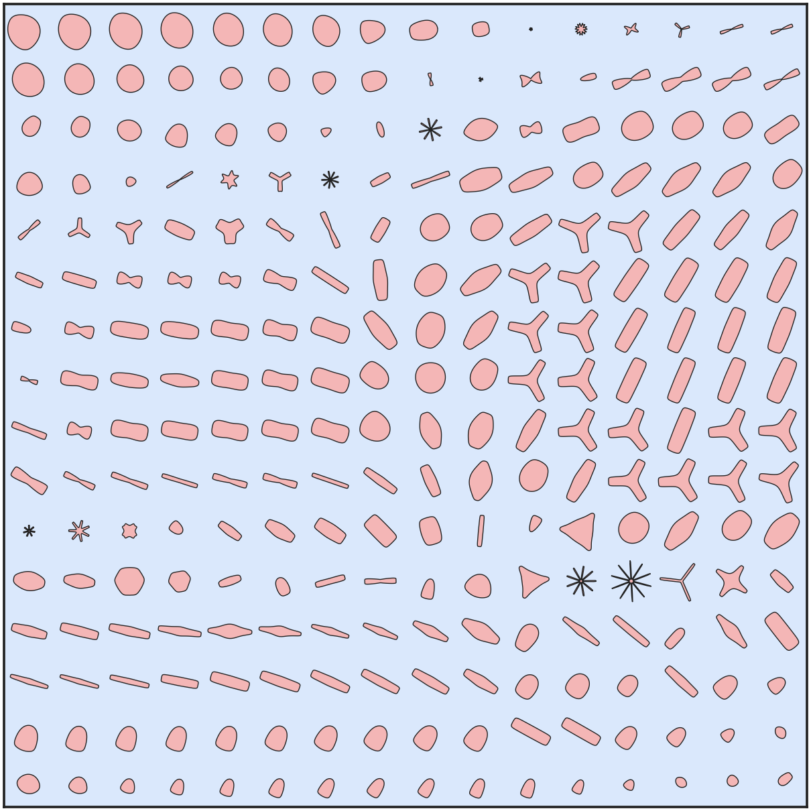 |  |

### 数值对比（真实功率 / 真实接触面积；扩散器星形占比 = m>4 的单胞比例）

| 方法 | 弯管功率<br>(论文 15.1) | 分叉管<br>功率 / CA | 扩散器<br>功率 / CA (论文 ~25/60) | 扩散器<br>星形占比 | 视觉 |
|---|:---:|:---:|:---:|:---:|---|
| 基线 P6b | **13.06** | 29.5 / 70.2 | **22.9** / 48 | 62% | 星形墙 |
| A 有效面积 | 13.06 | 29.7 / 54.1 | 52.6 / 46.4 | 9.8% | 卵形/透镜（最佳） |
| B 流体库 | **15.01** | 47.3 / 66.3 | 45.8 / 53.8 | **0.0%** | 成排圆墙（贴论文） |
| C 惩罚 | 13.06 | 49.7 / 58.2 | 66.7 / 51.0 | 0.9% | 椭圆/透镜 |

**核心结论**：三种机制都成功把形状推向好流动族（星形占比 62%→0–10%），验证了流体物理直觉；
但都暴露一个真实权衡——去掉星形后同等接触面积下**功率反升**，因为**星形作"墙"本是高效的**
（各向同性、低渗阻流、又廉价提供接触面积），而墙体本就要阻流。按目标选：要论文**长相** → B
（零星形、圆墙）；要最低**功率数值** → 基线 P6b；最有**原理**、通向两全 → A（有效面积，需补约束达成）。
完整分析见各分支提交说明与复现文档。

## P8–P12 完整研究谱系：两个正交轴

三方法（P8）揭示了"星形↔功率"权衡后，沿两条正交轴继续深入，把 TOMAS 复现的整个设计空间映射了出来：

- **VAE 容量/重构轴**：隐空间 2→3 维（[`p9-latent3d`](../../tree/p9-latent3d)）+ KL 正则甜点 1e-8（[`p11-vaequality`](../../tree/p11-vaequality)）→ 把 C00/C11 重构误差从 **45% 一路压到 13%**，**功率 floor 下移**。
- **形状选择轴**：流体原则库 / 有效面积 / 惩罚 → 决定**视觉清洁度**（星 vs 圆/透镜）。

| 里程碑 | 配置 | C00 重构 | 弯管 (论文15.1) | 扩散器 功率/CA (论文~25/60) | 形状 |
|---|---|:---:|:---:|:---:|---|
| 基线 P6b | 2D | 45% | 13.06 | 22.9 / 48 | 星 |
| p9 | 3D | 24% | 16.6 | **20.6** / 53 | 星 |
| **kl8** | 3D+kl1e-8（全库） | **13%** | **15.52** | **24.17 / 58.6** | 星 |
| p10 | 3D+m≤4库 | 18% | 16.9 | 41.9 / 55 | 圆/透镜 |
| **p12** | 3D+kl1e-8+m≤4库 | 18% | **13.82** | 41.3 / 53.7 | 圆/透镜 |

### 两个极点：最佳数值 vs 最佳清洁

| | 弯管 Fig 11 | 扩散器 Fig 13 |
|---|:---:|:---:|
| **kl8** — 最佳数值<br>(扩散器 24.17≈论文25, 弯管 15.52≈15.1)，但星形 | 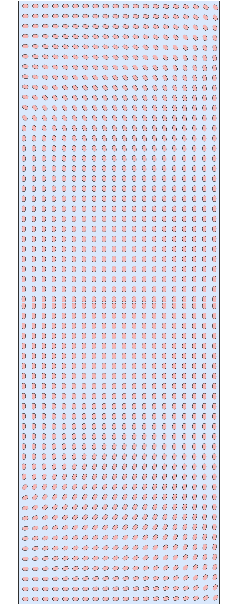 | 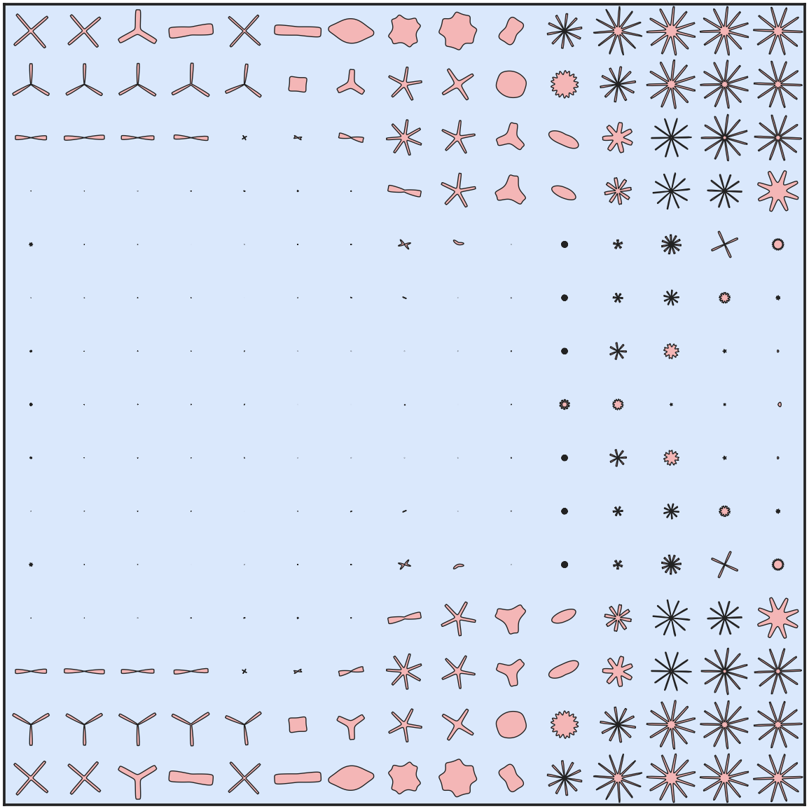 |
| **p12** — 最佳清洁<br>(弯管 13.82, 全零星形, 贴 Fig 11d/16b) | 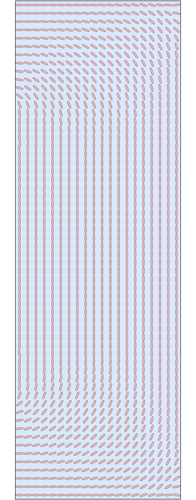 | 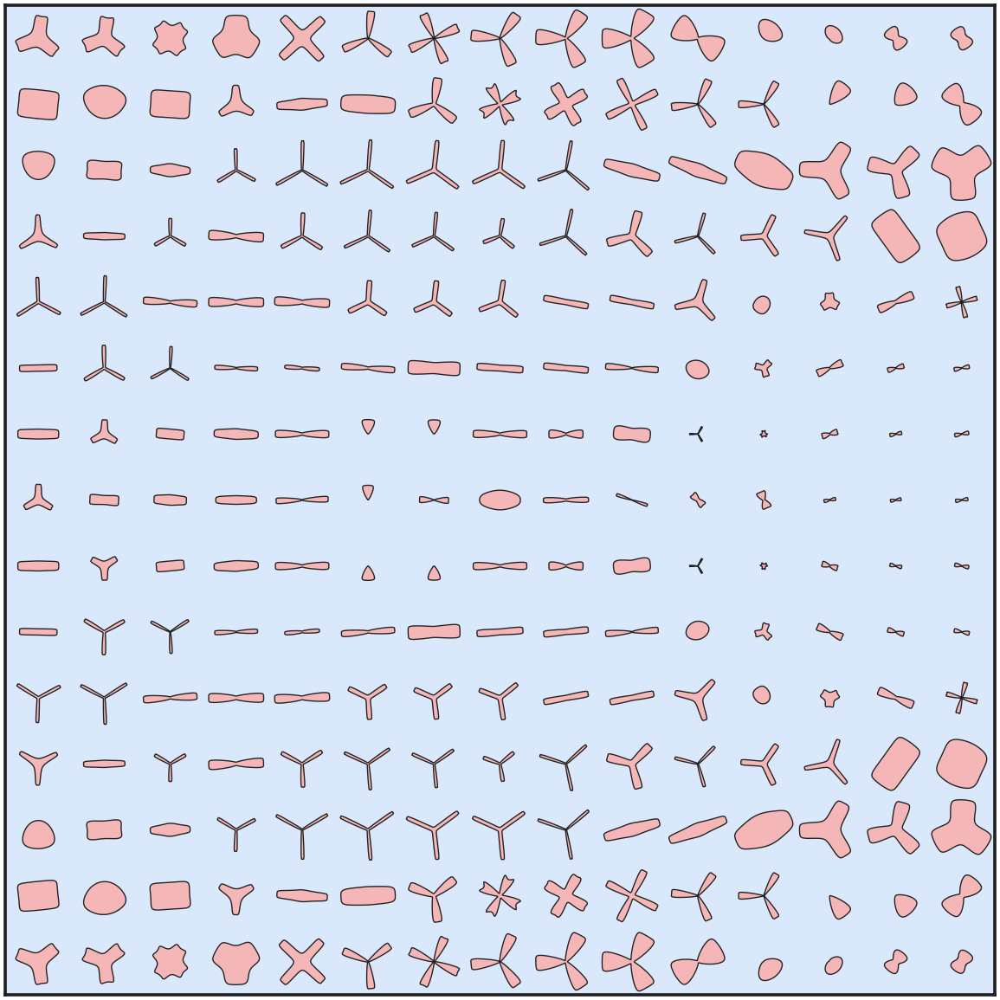 |

**最终定论**：① **VAE 重构质量**（3D + KL 甜点）决定功率 floor——把扩散器/弯管压到论文数值（kl8：扩散器 24.17≈25、弯管 15.52≈15.1，数值首次几乎完全复现论文）；② **形状方法**决定清洁度。**弯管/分叉管已两全**（p12 弯管 13.82 干净且≈论文）；**唯独扩散器的"干净圆 + 25"是残余差距**——clean-floor ~42 对所有改进稳健（2D-B 45.8→3D 41.9→3D+kl8 41.3），归因于论文的干净圆既干净又渗透高效，而我们的干净圆达不到那个效率（最可能其圆更大更密，或其 2D 重构仍优于我们最好的 13%）。

> 分支谱系（均已 push）：`p8a/p8b/p8c`（三方法）→ `p9-latent3d`（3D）→ `p10-3dlib`（3D+库）→ `p11-vaequality`（KL甜点）→ `p12-final`（全叠加）。详见复现文档飞书归档 §13–§16。
