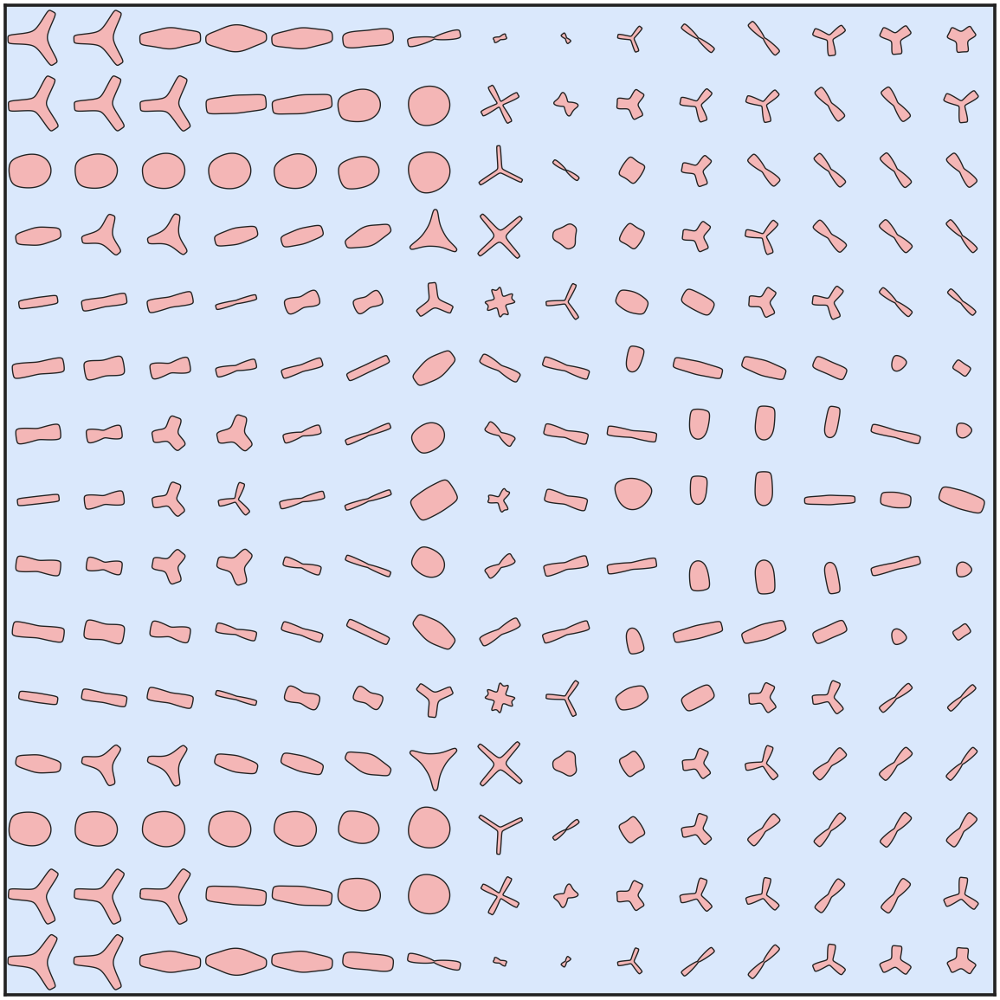

# 复现 TOMAS（多尺度流体拓扑优化 + VAE + super-shapes）

复现论文 *TOMAS: topology optimization of multiscale fluid flow devices using
variational auto-encoders and super-shapes*（Padhy, Suresh, Chandrasekhar，
Struct Multidiscip Optim 2024, 67:119），原始代码：https://github.com/UW-ERSL/TOMAS

**完整复现过程见 [`docs/复现文档.md`](docs/复现文档.md)。**

## 本工作做了什么
- 在 **WSL (Ubuntu-22.04)** 中端到端配置并运行了全部代码（数据生成 → VAE 训练 →
  多尺度流动拓扑优化 → 真实 FEA 验证），复现论文 §3.1–§3.7 的全部数值实验与图像。
- 把原仓库中 **MATLAB 部分（流体数值均匀化）完整改写为 Python**
  （`dataset_py/fluid_homogenization.py`），并以解析解验证其正确性。
- 用 **MKL PARDISO（单次提速约 60×）+ 32 核 joblib 样本级并行** 加速样本生成：
  7000 个微结构均匀化由论文的 164 min（串行）降到 **18.5 min**（约 9× 壁钟加速）。
- 修复了原仓库 7 处导致无法端到端运行的问题（见文档 §2）。

## 快速开始（WSL 内）
```bash
source ~/tomas-venv/bin/activate
cd /mnt/e/Working/reproduceTOMAS
python -u dataset_py/run_data_generation.py --num-samples 7000 --data-dir TOMAS/dataset
python -u scripts/run_train_vae.py
bash scripts/run_all_experiments.sh
python scripts/collect_results.py
```

## 关键结果（与论文对照，详见文档 §5）
| 指标 | 论文 | 本复现 |
|---|---|---|
| 扩散器最大速度幅值（接触面积 60） | 2.81 | **2.77**（1.4%） |
| 弯管真实-FEA 验证误差（功率 / 接触面积） | 4.0% / 3.7% | 2.5% / 5.6% |
| 数据生成 7000 样本 | 164 min | **18.5 min** |

速度场、约束满足、真实-FEA 验证误差等关键指标与论文吻合；少数定量差异
（Pareto 单调性、个别耗散功率绝对值）源自独立训练的 2 维隐空间 VAE 重构精度有限
与梯度优化局部最优，属从零复现 VAE 类方法的预期范围。

---

## 本分支：方法 C — 流动品质惩罚项（p8c-flowquality-penalty）

**动机**：从流体力学看，星/齿轮（高 m）和凹边（低 n）形状不利于流动。本分支在拓扑优化的目标函数里
加一个**流动品质惩罚** `relu(m - 4) + relu(1 - min(n1,n2,n3))`，直接把设计推离星/齿轮/凹形，朝
叶/透镜/圆走；惩罚只针对瓣数与凹度，**不惩罚拉长**，从而保住弯管所需的各向异性透镜。

**用法**：`scripts/run_to.py --flow-quality-weight 20 --fq-m0 4 --fq-n0 1`（见 `scripts/run_p8c.sh`）。

**结果图（P6b VAE + 流动品质惩罚，真实-FEA）**：

| 弯管 Fig 11 (真实 13.06) | 分叉管 Fig 16 (49.7 / CA 58) | 扩散器 Fig 13 (66.7 / CA 51) |
|:---:|:---:|:---:|
|  |  |  |

形状成功净化（扩散器 m 6.12→2.16、星形占比 0.9%，变椭圆/透镜）；但功率反升（扩散器 22.9→66.7）——
这是一个**关键反直觉**：几何周长度量下星形本是目标真最优（廉价周长），用惩罚硬掰=对抗目标 → 功率代价。
正因此，从源头修度量的方法 A（有效接触面积）更治本。三方法横向对比见 `pure-claude` 分支 README。
