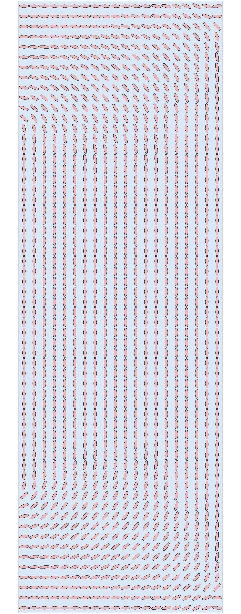

# 复现 TOMAS（多尺度流体拓扑优化 + VAE + super-shapes）

复现论文 *TOMAS: topology optimization of multiscale fluid flow devices using
variational auto-encoders and super-shapes*（Padhy, Suresh, Chandrasekhar，
Struct Multidiscip Optim 2024, 67:119），原始代码：https://github.com/UW-ERSL/TOMAS

**完整复现过程见 [`docs/复现文档.md`](docs/复现文档.md)。**

## 本工作做了什么
- 在 **WSL (Ubuntu-22.04)** 中端到端配置并运行了全部代码（数据生成 → VAE 训练 →
  多尺度流动拓扑优化 → 真实 FEA 验证），复现论文 §3.1–§3.7 的全部数值实验与图像。
- 把原仓库中 **MATLAB 部分（流体数值均匀化）完整改写为 Python**
  （`dataset_py/fluid_homogenization.py`），并以解析解验证其正确性。
- 用 **MKL PARDISO（单次提速约 60×）+ 32 核 joblib 样本级并行** 加速样本生成：
  7000 个微结构均匀化由论文的 164 min（串行）降到 **18.5 min**（约 9× 壁钟加速）。
- 修复了原仓库 7 处导致无法端到端运行的问题（见文档 §2）。

## 快速开始（WSL 内）
```bash
source ~/tomas-venv/bin/activate
cd /mnt/e/Working/reproduceTOMAS
python -u dataset_py/run_data_generation.py --num-samples 7000 --data-dir TOMAS/dataset
python -u scripts/run_train_vae.py
bash scripts/run_all_experiments.sh
python scripts/collect_results.py
```

## 关键结果（与论文对照，详见文档 §5）
| 指标 | 论文 | 本复现 |
|---|---|---|
| 扩散器最大速度幅值（接触面积 60） | 2.81 | **2.77**（1.4%） |
| 弯管真实-FEA 验证误差（功率 / 接触面积） | 4.0% / 3.7% | 2.5% / 5.6% |
| 数据生成 7000 样本 | 164 min | **18.5 min** |

速度场、约束满足、真实-FEA 验证误差等关键指标与论文吻合；少数定量差异
（Pareto 单调性、个别耗散功率绝对值）源自独立训练的 2 维隐空间 VAE 重构精度有限
与梯度优化局部最优，属从零复现 VAE 类方法的预期范围。

---

## 本分支：方法 B — 流体原则库（p8b-fluid-library）

**动机**：从流体力学看，叶/透镜/鱼/眼/圆有良好流动特性，而星/齿轮（高 m）不利于流动。数据佐证：
流动品质 C_major/perim 叶 0.034 ≫ 星 0.004（差 9 倍）。本分支按此把数据库 super-shape 的瓣数
**m 上限从 11 降到 4**（保留叶/透镜/鱼/圆，裁掉扇贝 m4-7 + 星 m7-11），并配各向异性温和分层重训
VAE，使弯管所需的强各向异性透镜仍被保留。

**用法**：`datagen.yaml` 设 `max_m: 4`；`run_train_vae.py --aniso-stratify --aniso-power 0.5`（见 `scripts/run_p8b.sh`）。

**结果图（流体原则库单一 VAE，真实-FEA）**：

| 弯管 Fig 11 (真实 15.01≈论文15.1) | 分叉管 Fig 16 (47.3 / CA 66) | 扩散器 Fig 13 (45.8 / CA 54) |
|:---:|:---:|:---:|
|  |  |  |

**零星形**（m>4 占比 0.0%）：弯管是细长透镜密铺绕弯（贴 Fig 11d），分叉管/扩散器是成排圆形 + 透镜
（贴 Fig 16b/13b），是**最贴论文长相**的方案；M* 默认选出 180× 各向异性。代价：扩散器/分叉管功率
偏高（~45），因星形作"墙"本是高效的（阻流 + 廉价接触面积）而被裁掉。三方法横向对比见 `pure-claude` 分支 README。
